

 

<table align="center" style="border: none; border-collapse: collapse; background: transparent;">
<tr style="border: none; background: transparent;">
<td valign="top" width="400" style="border: none; background: transparent;">
<picture>
<source media="(prefers-color-scheme: dark)" srcset="./ascii-art-v2.svg" />
<source media="(prefers-color-scheme: light)" srcset="./ascii-art-v2.svg" />

</picture>
</td>
<td valign="top" width="450" style="border: none; background: transparent; padding-left: 20px;">

 
<h3>◈ About</h3>

Second-year BCA student at <b>BIT Mesra, Jaipur</b> building AI-powered full-stack applications. Passionate about LLM integration, real-world product engineering, and shipping things that actually work.

 
<h3>◈ Connect</h3>
 
 
 

 
 

</td>
</tr>
</table>

---

## ◈ Tech Stack

---

## ◈ GitHub Stats

&nbsp;&nbsp;

---

## ◈ Contribution Snake

<picture>
  <source media="(prefers-color-scheme: dark)" srcset="https://raw.githubusercontent.com/atharva22agarwal-afk/atharva22agarwal-afk/output/github-snake-dark.svg" />
  <source media="(prefers-color-scheme: light)" srcset="https://raw.githubusercontent.com/atharva22agarwal-afk/atharva22agarwal-afk/output/github-snake.svg" />
  
</picture>

 

